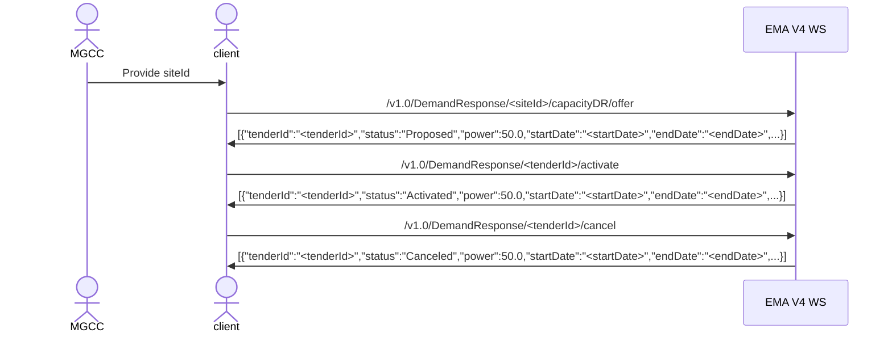

```mermaid
sequenceDiagram
actor M as MGCC
actor C as client
participant E as EMA V4 WS
 
M ->> C: Provide siteId
C ->> E:  /v1.0/DemandResponse/<siteId>/capacityDR/offer
E ->> C: [{"tenderId":"<tenderId>","status":"Proposed","power":50.0,"startDate":"<startDate>","endDate":"<endDate>",...}]
C ->> E: /v1.0/DemandResponse/<tenderId>/activate
E ->> C : [{"tenderId":"<tenderId>","status":"Activated","power":50.0,"startDate":"<startDate>","endDate":"<endDate>",...}]
C ->> E: /v1.0/DemandResponse/<tenderId>/cancel
E ->> C : [{"tenderId":"<tenderId>","status":"Canceled","power":50.0,"startDate":"<startDate>","endDate":"<endDate>",...}]
```