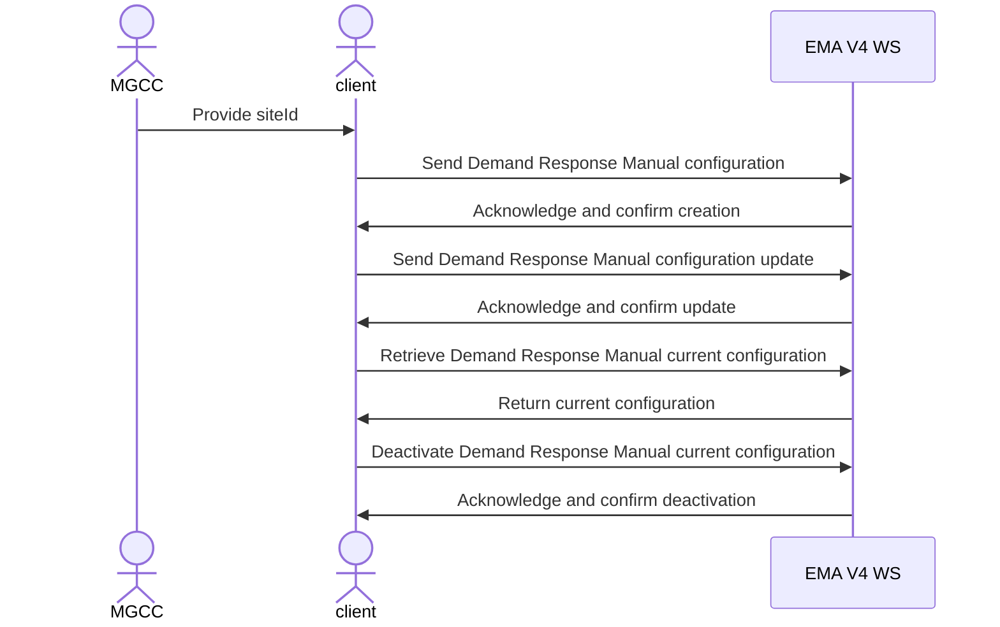

```mermaid
sequenceDiagram
actor M as MGCC
actor C as client
participant E as EMA V4 WS
 
M ->> C: Provide siteId
C ->> E: Send Demand Response Manual configuration
E ->> C: Acknowledge and confirm creation
C ->> E: Send Demand Response Manual configuration update
E ->> C: Acknowledge and confirm update
C ->> E: Retrieve Demand Response Manual current configuration
E ->> C: Return current configuration
C ->> E: Deactivate Demand Response Manual current configuration
E ->> C: Acknowledge and confirm deactivation
```