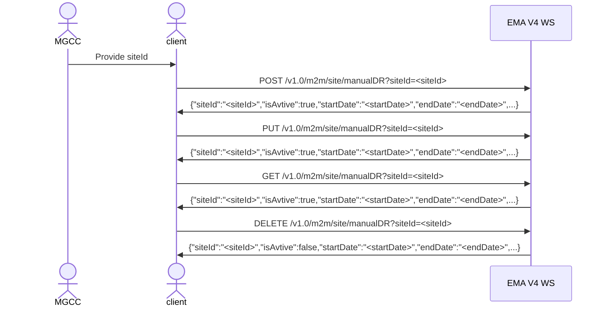

```mermaid
sequenceDiagram
actor M as MGCC
actor C as client
participant E as EMA V4 WS
 
M ->> C: Provide siteId
C ->> E: POST /v1.0/m2m/site/manualDR?siteId=<siteId>
E ->> C: {"siteId":"<siteId>","isAvtive":true,"startDate":"<startDate>","endDate":"<endDate>",...}
C ->> E: PUT /v1.0/m2m/site/manualDR?siteId=<siteId>
E ->> C: {"siteId":"<siteId>","isAvtive":true,"startDate":"<startDate>","endDate":"<endDate>",...}
C ->> E: GET /v1.0/m2m/site/manualDR?siteId=<siteId>
E ->> C: {"siteId":"<siteId>","isAvtive":true,"startDate":"<startDate>","endDate":"<endDate>",...}
C ->> E: DELETE /v1.0/m2m/site/manualDR?siteId=<siteId>
E ->> C: {"siteId":"<siteId>","isAvtive":false,"startDate":"<startDate>","endDate":"<endDate>",...}
```