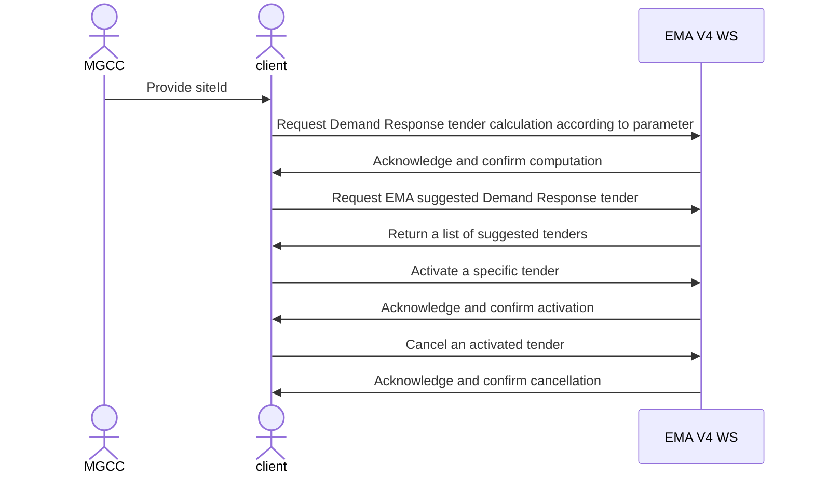

```mermaid
sequenceDiagram
actor M as MGCC
actor C as client
participant E as EMA V4 WS
 
M ->> C: Provide siteId
C ->> E: Request Demand Response tender calculation according to parameter
E ->> C: Acknowledge and confirm computation
C ->> E: Request EMA suggested Demand Response tender 
E ->> C: Return a list of suggested tenders
C ->> E: Activate a specific tender
E ->> C: Acknowledge and confirm activation
C ->> E: Cancel an activated tender
E ->> C: Acknowledge and confirm cancellation
```