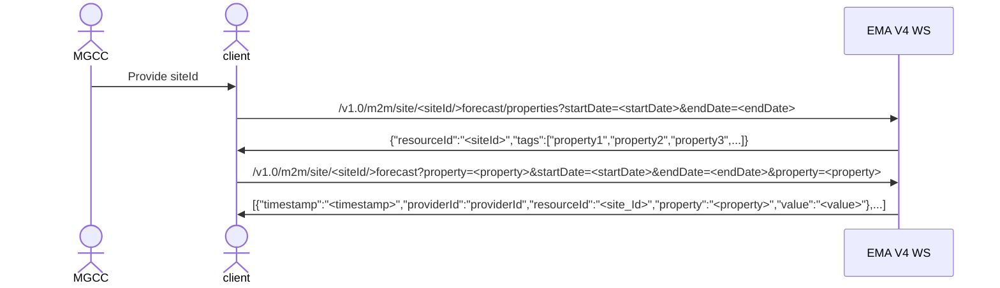

```mermaid
sequenceDiagram
actor M as MGCC
actor C as client
participant E as EMA V4 WS
 
M ->> C: Provide siteId
C ->> E:  /v1.0/m2m/site/<siteId/>forecast/properties?startDate=<startDate>&endDate=<endDate>
E ->> C: {"resourceId":"<siteId>","tags":["property1","property2","property3",...]}
C ->> E: /v1.0/m2m/site/<siteId/>forecast?property=<property>&startDate=<startDate>&endDate=<endDate>&property=<property>
E ->> C : [{"timestamp":"<timestamp>","providerId":"providerId","resourceId":"<site_Id>","property":"<property>","value":"<value>"},...]
```