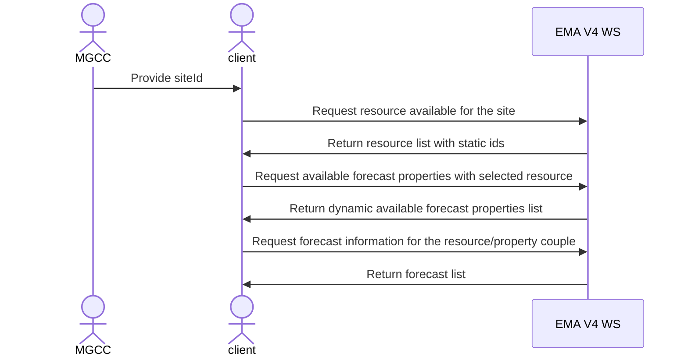

```mermaid
sequenceDiagram
actor M as MGCC
actor C as client
participant E as EMA V4 WS
 
M ->> C: Provide siteId
C ->> E: Request resource available for the site
E ->> C: Return resource list with static ids
C ->> E: Request available forecast properties with selected resource
E ->> C: Return dynamic available forecast properties list
C ->> E: Request forecast information for the resource/property couple
E ->> C : Return forecast list 
```