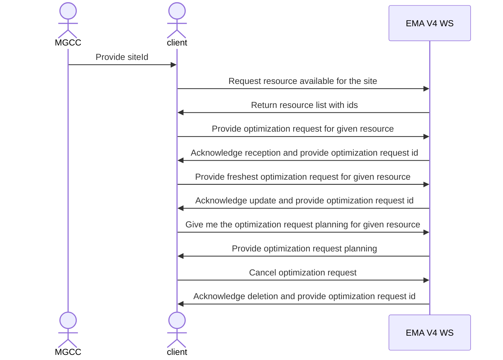

```mermaid
sequenceDiagram
actor M as MGCC
actor C as client
participant E as EMA V4 WS
 
M ->> C: Provide siteId
C ->> E: Request resource available for the site
E ->> C: Return resource list with ids
C ->> E: Provide optimization request  for given resource
E ->> C: Acknowledge reception and provide optimization request id
C ->> E: Provide freshest optimization request for given resource
E ->> C: Acknowledge update and provide optimization request id
C ->> E: Give me the optimization request  planning for given resource
E ->> C: Provide optimization request planning
C ->> E: Cancel optimization request 
E ->> C: Acknowledge deletion and provide optimization request id
```