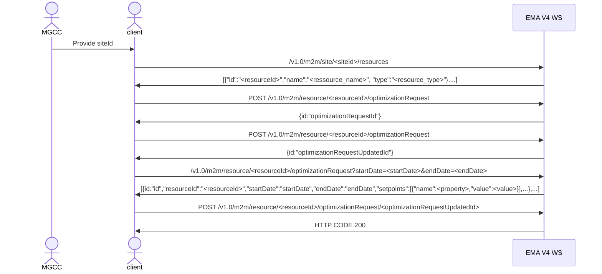

```mermaid
sequenceDiagram
actor M as MGCC
actor C as client
participant E as EMA V4 WS
 
M ->> C: Provide siteId
C ->> E: /v1.0/m2m/site/<siteId>/resources
E ->> C: [{"id":"<resourceId>","name":"<ressource_name>", "type":"<resource_type>"},...]
C ->> E: POST /v1.0/m2m/resource/<resourceId>/optimizationRequest
E ->> C : {id:"optimizationRequestId"}
C ->> E: POST /v1.0/m2m/resource/<resourceId>/optimizationRequest
E ->> C : {id:"optimizationRequestUpdatedId"}
C ->> E: /v1.0/m2m/resource/<resourceId>/optimizationRequest?startDate=<startDate>&endDate=<endDate>
E ->> C : [{id:"id","resourceId":"<resourceId>","startDate":"startDate","endDate":"endDate","setpoints":[{"name":<property>,"value":<value>}],...},...]
C ->> E: POST /v1.0/m2m/resource/<resourceId>/optimizationRequest/<optimizationRequestUpdatedId>
E ->> C : HTTP CODE 200
```